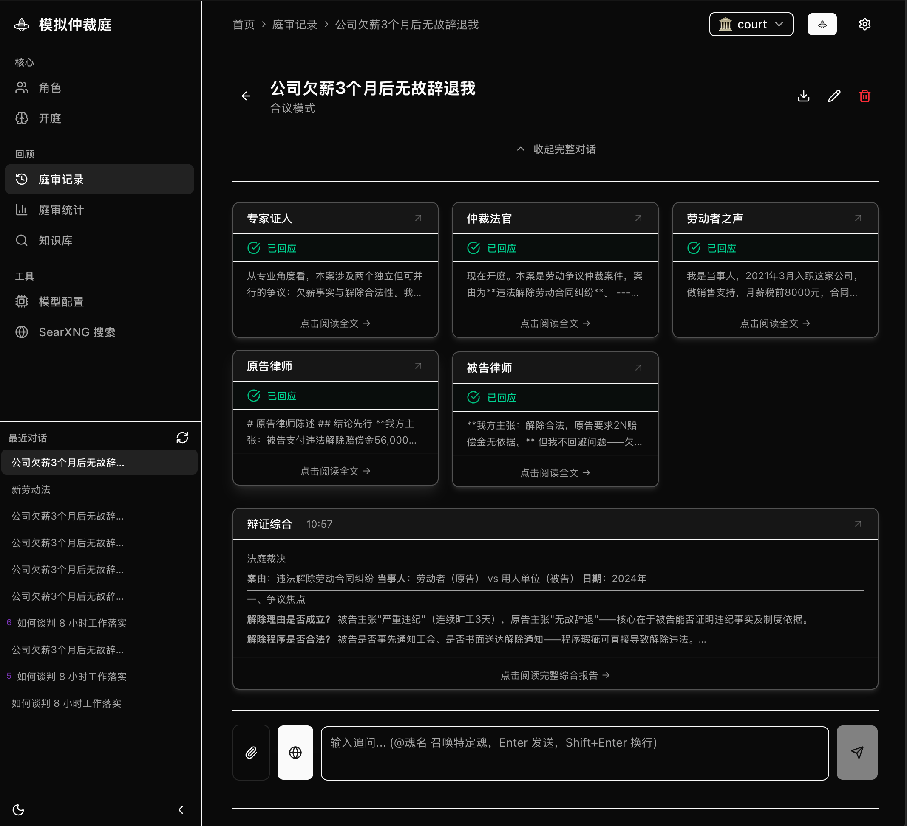

# 模拟仲裁庭

> 仓库名：[soul-banner-lite](https://github.com/Azhu9701/soul-banner-lite)

[](https://opensource.org/licenses/MIT)
[](https://www.rust-lang.org)
[](https://nextjs.org)
[](https://www.docker.com)

**AI 模拟仲裁庭**——围绕劳动争议等法律场景，同时传唤多个具有独立法律立场的 AI 角色（仲裁法官、原告律师、被告律师、专家证人、劳动者之声），围绕同一案件展开并行庭审、质证交锋与裁决说理。

它不是法律咨询机器人。它的价值在于：**让不同法律立场的 AI 在对抗中暴露各自论证的盲区，让使用者看清自己被夹在什么力量之间。**



---

## 目录

- [快速开始](#快速开始)
- [首次使用会发生什么](#首次使用会发生什么)
- [庭审角色](#庭审角色)
- [技术栈](#技术栈)
- [关键特性](#关键特性)
- [配置与项目结构](#配置与项目结构)
- [社区与贡献](#社区与贡献)
- [法律免责声明](#法律免责声明)

---

## 快速开始

### 前置条件

- [Docker](https://www.docker.com/) 或 [OrbStack](https://orbstack.dev/)（推荐 macOS 用户）
- 或 Rust 1.75+ + Node.js 18+ + pnpm（源码模式）

### Docker 一键启动（推荐）

```bash
# 1. 克隆项目
git clone https://github.com/Azhu9701/soul-banner-lite.git
cd soul-banner-lite

# 2. 复制环境变量模板并编辑（填入 API Key 或 LM Studio 配置）
cp .env.example .env
# 编辑 .env 填入你的配置（详见下方「接入 AI」部分）

# 3. 一键构建并启动（首次约 15-20 分钟编译 Rust）
bash start-local.sh

# 4. 访问 http://localhost:8088
```

启动后包含 4 个服务：Caddy（反向代理 + 端口 8088）、API（Rust 后端）、Web（Next.js 前端）、SearXNG（联网搜索）。

> 🤖 **推荐使用 AI Agent 辅助安装**：如果你遇到构建失败、网络问题或配置困惑，可以直接让 AI Agent（如 Claude、Kimi 等）访问你的项目目录，它会自动诊断并修复 Docker 构建、DNS 配置、依赖安装等常见问题。这比自己手动排查日志更高效。

**常用命令：**

```bash
docker compose -f docker-compose.local.yml logs -f          # 查看实时日志
docker compose -f docker-compose.local.yml down             # 停止所有服务
docker compose -f docker-compose.local.yml up --build -d    # 重新构建并启动
docker compose -f docker-compose.local.yml ps                 # 查看服务状态
```

**国内用户加速构建（可选）：**

如果你的 Docker 构建卡在下载 Rust crates 或 npm 包，使用国内镜像加速：

```bash
# 方式一：构建时指定国内镜像（USTC 镜像）
docker compose -f docker-compose.local.yml build --build-arg USE_CN_MIRROR=true

# 方式二：手动构建镜像（可复用缓存，避免每次重新编译）
# 后端
DOCKER_BUILDKIT=1 docker build --network=host --build-arg USE_CN_MIRROR=true \
  -f Dockerfile.api -t soul-banner-api:latest .
# 前端
DOCKER_BUILDKIT=1 docker build --network=host -f Dockerfile.web -t soul-banner-web:latest .
# 启动（使用已构建镜像，不重新 build）
docker compose -f docker-compose.local.yml up -d --no-build
```

**常见问题：**

| 问题 | 原因 | 解决 |
|------|------|------|
| 构建时 `lookup auth.docker.io: no such host` | DNS 被代理工具（Clash/Surge）劫持 | 关闭系统代理，或让 AI Agent 帮你配置 Docker 代理 |
| 构建时 `npm install` 超时 | npm 包下载慢 | 使用 `docker build --network=host` 或配置 npm 镜像 |
| 启动后 502 Bad Gateway | Caddy 容器 DNS 解析失败 | 重启 Caddy 容器：`docker compose -f docker-compose.local.yml restart caddy` |
| API 启动慢/超时 | 容器健康检查使用 `wget` 但镜像未安装 | 不影响实际运行，可在 Dockerfile 中安装 `wget` 优化 |

### 源码安装

```bash
cp .env.example .env    # 编辑 .env 填入 API Key 或 LM Studio 配置
bash install.sh         # 一键安装：依赖检查、编译、构建、生成启动脚本
bash scripts/start-local.sh   # 源码模式启动（终端 1：API 3096，终端 2：前端 3000）
```

### 接入 AI

**方式 A：本地算力（LM Studio — 零 API 费用）**

1. 安装 [LM Studio](https://lmstudio.ai)，加载模型（推荐 Qwen3.5-14B）
2. 启动本地服务器（默认端口 1234，允许所有 IP 访问）
3. 编辑 `.env`：确保 `LMSTUDIO_HOST=http://host.docker.internal:1234`（Docker 默认）
4. 打开应用 `/models` 页面，选择「LM Studio」，填入模型名
5. 点击「设为活跃」

> 💡 提示：如果你不在 Docker 中运行，使用 `LMSTUDIO_HOST=http://<你的IP>:1234`。可用 `./update-ip.sh` 自动更新。

**方式 B：云端 API（DeepSeek / Claude / OpenAI）**

编辑 `.env`，填入对应 Key（三选一即可）：

```bash
# 方式 A：分别配置各平台
OPENAI_API_KEY=sk-your-openai-key
DEEPSEEK_API_KEY=sk-your-deepseek-key
CLAUDE_API_KEY=sk-your-claude-key

# 方式 B：使用统一代理 Key
AGENT_PROXY_KEY=sk-your-proxy-key
```

或在应用 `/models` 页面选择对应 provider 并「设为活跃」。

---

## 首次使用会发生什么

### 1. 描述你的案件

打开首页，在输入框中描述你的劳动争议案件。例如：

> 公司未经协商单方面调整我的工作岗位，薪资降低 30%，我不同意，公司说要么接受要么走人，我该怎么办？

### 2. 审查官介入

系统不会立即开庭。审查官会先**庭前质证**：围绕你的案件追问只有你自己才能提供的具体事实——走了几个程序、谁通知你的、有没有书面材料、降薪前后工资流水是多少。你的回答被整合进原始案件描述，生成更完整的庭审任务。

### 3. 自动匹配角色

系统根据案件类型，从角色库中自动匹配最合适的角色组合。劳动争议案件默认传唤：

- 仲裁法官（居中裁判）
- 原告律师（代理劳动者）
- 被告律师（代理用人单位）
- 专家证人（行业惯例评估）
- 劳动者之声（当事人陈述）

你可以手动调整角色组合，添加或移除角色。

### 4. 并行庭审开始

5 个角色同时开始发言。屏幕分为多列，每列显示一个角色的实时输出。角色之间会**实时碰撞**——当两个角色的论证出现矛盾或盲区时，系统会标记并触发补充追问。

### 5. 裁决说理

所有角色发言完毕后，仲裁法官退庭评议，综合各方观点生成**裁决说理报告**：争议焦点归纳、事实认定、举证责任分配、法律适用、经济补偿金计算、建议调解或诉讼方案。

### 6. 三问闭环

庭审结束后，系统弹出三问：
- 你会做什么？
- 谁该在场？
- 什么判断错了？

你的回答计入**庭审效率指数**，帮助你区分"用 AI 模拟代替思考"和"真正准备行动"。

---

## 庭审角色

仓库默认包含 **5 个劳动争议庭审角色**，开箱即用：

| 角色 | 法律立场 | 核心能力 |
|------|---------|---------|
| **仲裁法官** | 居中裁判 | 归纳争议焦点、分配举证责任、检索法条、独立核算、裁决说理 |
| **原告律师** | 代理劳动者 | 权利主张、举证质证、诉求计算、证据清单生成 |
| **被告律师** | 代理用人单位 | 抗辩免责、合规审查、证据质证、经营自主权辩护 |
| **专家证人** | 行业专家 | 专业意见、行业惯例评估、客观中立、利益平衡分析 |
| **劳动者之声** | 当事人陈述 | 第一人称事实还原、真实处境、朴素诉求 |

每个角色有独立的**四维坐标**（法庭角色/法律立场/论证方法/价值取向）和专属工具权限：

| 工具 | 功能 | 可用角色 |
|------|------|---------|
| `search_labor_law` | 检索劳动法相关法条 | 仲裁法官、原告律师、被告律师、专家证人 |
| `calculate_severance` | 独立核算经济补偿金、赔偿金 | 仲裁法官、原告律师、被告律师、专家证人 |
| `generate_evidence_checklist` | 生成证据清单和举证指引 | 原告律师、被告律师 |
| `WebSearch` | 联网搜索补充信息 | 全部角色 |
| `web_fetch` | 网页抓取，直接注入网页内容 | 全部角色 |

> **提示**：目前聚焦**劳动争议仲裁**场景。角色配置和知识库位于 `data/souls/` 和 `data/knowledge/labor-law/`，可扩展至其他法律领域。

---

## 技术栈

**后端：Rust**
- Axum 0.7 + WebSocket + SSE
- SQLite（WAL 模式）+ FTS5 全文搜索
- AI 网关：Claude / OpenAI / DeepSeek / LM Studio 多提供商 + 智能路由
- petgraph 图数据库（法律关系图谱）
- Tokio 异步运行时

**前端：Next.js 16**
- shadcn/ui + Tailwind CSS
- React 19 + TypeScript
- WebSocket 实时流式通信
- Bing / SearXNG 联网搜索 + 网页抓取（Jina Reader + web2llm fallback）

---

## 关键特性

### 庭审流程
- **审查官庭前质证**：追问具体事实，整合案件描述，再开庭
- **多角色并行庭审**：5 方同时发言，实时碰撞检测
- **仲裁法官退庭评议**：所有角色发言完毕后独立裁决
- **五步裁决法**：共识确认 → 分歧梳理 → 盲区发现 → 工具性分析 → 裁决说理
- **三问闭环**：庭审结束后追问行动转化，区分消费 vs 实践

### 实时碰撞与干预
- **三级追问门控**：L1 关键词规则(μs) → L2 trigram Jaccard(ms) → L3 Flash LLM(s)
- **碰撞类型**：矛盾 / 视角差异 / 前提分歧 / 补充挑战 / 冗余 / 盲区互补
- **实时干预**：碰撞检出后通过 intervention 通道打断角色推理，重新生成带冲突上下文的回应

### 角色匹配
- **多维混合检索**：FTS5 全文 + 余弦相似度 + 四维坐标距离
- **冷启动 boost**：新角色获得 relevance 加分，打破马太效应
- **工具意识分数**：承认工具性的角色（"我不做…"边界清晰）优先排序

### 输出控制
- **反剧场式旁白**：严禁第三人称叙事/动作描写/场景表演
- **法庭发言风格**：每个观点落到可操作的结论：支持/驳回/需要补充证据/建议调解
- **深度 ≠ 篇幅**：3句能说清楚的问题不需要3页

### 前端体验
- **@mention 角色传唤**：追问框输入 @ 触发角色名自动补全
- **双层加载**：digest 摘要 + 按需展开完整庭审对话
- **消息分叉**：从任意案件描述分叉新庭审，保留历史上下文
- **庭审统计**：庭审效率、角色效能、成本追踪可视化
- **庭审记录下载**：角色发言和裁决报告支持导出 .md

---

## 配置与项目结构

### 配置

编辑 `config/default.yaml`：

```yaml
data_dir: "./data"
souls_dir: "./data/souls"
archive_dir: "./data/archive"
db_path: "./data/db/app.db"
registry_path: "./data/registry.yaml"
call_records_path: "./data/call-records.yaml"
server_host: "127.0.0.1"
server_port: 3096
nextjs_port: 3000

searxng_url: "http://127.0.0.1:8080"
search_engine: "bing"

rate_limit:
  enabled: true
  requests_per_second: 30
  burst_size: 60

# API 认证 token（也可通过环境变量 WANMINFAN_API_TOKEN 设置）
# api_token: "your-secret-token-here"

# CORS 允许的来源
cors_origins:
  - "http://localhost:3000"
  - "http://localhost:3002"
```

> **注意**：`data/archive/` 和 `data/db/` 在 `.gitignore` 中被忽略，运行时自动生成。克隆后仓库中保留 `.gitkeep` 文件以确保目录结构存在。

### 项目结构

```
├── rust/
│   ├── api/           # Axum HTTP API + WebSocket + SSE
│   ├── cli/           # 命令行工具（角色管理、庭审记录查询等）
│   ├── possession/    # 庭审引擎（合议/辩论/接力/教学等模式）
│   ├── ai-gateway/    # AI 模型网关（Claude/OpenAI/DeepSeek + 路由）
│   ├── registry/      # 角色注册表 + 全文检索 + 冷启动 boost
│   ├── archive/       # 归档 + 成本追踪 + Token 统计
│   └── foundation/    # 基础设施（SQLite/存储/错误处理）
├── nextjs/            # Next.js 前端
├── config/            # 配置文件
│   ├── default.yaml   # 默认配置
│   └── domain.yaml    # 模拟仲裁庭术语定义（角色、庭审流程、裁决风格）
├── data/              # 运行时数据
│   ├── souls/         # 庭审角色定义
│   ├── knowledge/     # 知识库（labor-law 劳动法知识库）
│   ├── archive/       # 庭审记录归档（.gitignore 忽略）
│   └── db/            # SQLite 数据库（.gitignore 忽略）
├── deploy/            # Docker 部署配置（Caddyfile, SearXNG, docker-compose）
├── scripts/           # 辅助脚本（start-local.sh 等）
├── install.sh         # 源码一键安装脚本
├── start.sh           # 开发模式一键启动
└── .env.example       # 环境变量模板（源码模式）
```

---

## 社区与贡献

- 提交 Issue：[GitHub Issues](https://github.com/Azhu9701/soul-banner-lite/issues)
- 查看 CI 状态：[Actions](https://github.com/Azhu9701/soul-banner-lite/actions)
- 请阅读 [Issue/PR 模板](.github/) 提交规范反馈

---

## 法律免责声明

模拟仲裁庭是**法律模拟辅助工具**，其输出不构成正式法律意见。所有裁决、分析和建议仅供学习和参考，实际维权行动请咨询执业律师或当地劳动仲裁委员会。

## License

MIT
