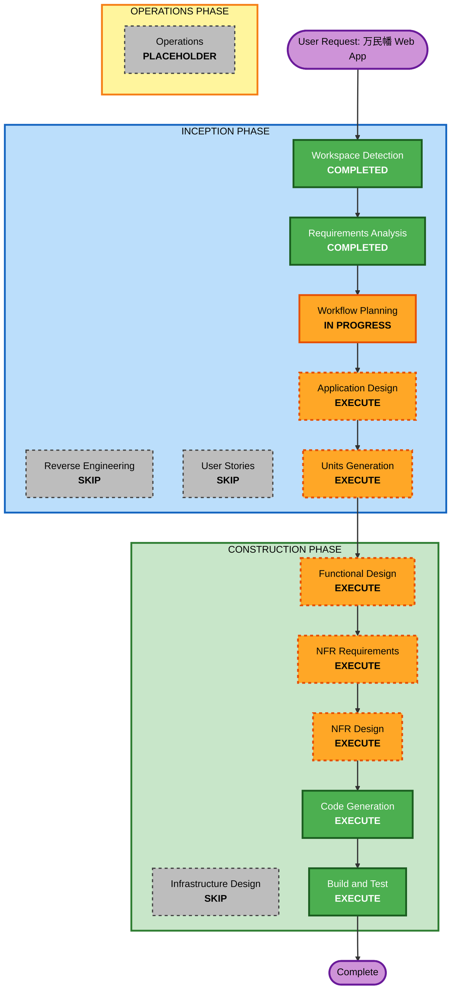

# Execution Plan — 万民幡 Web Application

## Detailed Analysis Summary

### Change Impact Assessment
- **User-facing changes**: Yes — 完整 Web UI，含多魂合议可视化界面
- **Structural changes**: Yes — 全新系统架构（前端 + Rust 后端 + AI 集成层 + 本地存储）
- **Data model changes**: Yes — SQLite schema（registry、call-records、sessions）+ 文件系统（魂档案、对话存档）
- **API changes**: Yes — REST API + SSE 流式端点
- **NFR impact**: Yes — 流式响应、多魂并行 AI 调用、分层数据访问

### Risk Assessment
- **Risk Level**: Medium
- **Rollback Complexity**: Easy（greenfield，无遗留系统）
- **Testing Complexity**: Moderate（多模式 AI 对话测试 + 流式响应测试）
- **Key Unknowns**: Rust 生态的 LLM API 客户端成熟度、多魂并行的 session 管理

## Workflow Visualization



### Text Alternative
```
Phase 1: INCEPTION
- Workspace Detection (COMPLETED)
- Reverse Engineering (SKIP — greenfield)
- Requirements Analysis (COMPLETED)
- User Stories (SKIP — user chose not to include)
- Workflow Planning (IN PROGRESS)
- Application Design (EXECUTE) — new components, service layer needed
- Units Generation (EXECUTE) — multiple packages

Phase 2: CONSTRUCTION
- Per-Unit Loop:
  - Functional Design (EXECUTE) — complex business logic
  - NFR Requirements (EXECUTE) — streaming, AI parallelism
  - NFR Design (EXECUTE) — patterns for streaming, AI integration
  - Infrastructure Design (SKIP) — local deployment, no cloud infra
- Code Generation (EXECUTE)
- Build and Test (EXECUTE)

Phase 3: OPERATIONS
- Operations (PLACEHOLDER)
```

## Phases to Execute

### INCEPTION PHASE
- [x] Workspace Detection (COMPLETED)
- [x] Reverse Engineering — **SKIP** (greenfield)
- [x] Requirements Analysis (COMPLETED)
- [x] User Stories — **SKIP** (user chose not to include)
- [x] Workflow Planning (IN PROGRESS)
- [ ] Application Design — **EXECUTE**
  - **Rationale**: Greenfield 项目，需定义组件结构、服务层、数据模型关系。含 Registry 服务、Possession 引擎、Archive 系统、Analytics 模块等多个新组件
- [ ] Units Generation — **EXECUTE**
  - **Rationale**: 系统跨多个 package（前端 UI / Rust 后端 / AI 集成层 / 存储层），需拆分为可并行开发的 work unit

### CONSTRUCTION PHASE
- [ ] Functional Design — **EXECUTE** (per-unit)
  - **Rationale**: 合议辩证综合、实践开口分流、魂审查 10 板块等复杂业务逻辑需详细功能设计
- [ ] NFR Requirements — **EXECUTE** (per-unit)
  - **Rationale**: 流式响应、多魂并行 AI 调用、分层数据访问、本地持久化策略等 NFR 需评估和选型
- [ ] NFR Design — **EXECUTE** (per-unit)
  - **Rationale**: SSE/WebSocket 流式模式、并行 AI 调用并发控制、prompt caching 策略需设计
- [ ] Infrastructure Design — **SKIP** (per-unit)
  - **Rationale**: 本地单机部署，SQLite + 文件系统，无云基础设施。无需此阶段
- [ ] Code Generation — **EXECUTE** (ALWAYS)
  - **Rationale**: Implementation planning and code generation needed
- [ ] Build and Test — **EXECUTE** (ALWAYS)
  - **Rationale**: Build, test, and verification needed

### OPERATIONS PHASE
- [ ] Operations — **PLACEHOLDER**
  - **Rationale**: Future deployment and monitoring workflows

## Estimated Timeline
- **Total Phases**: 6 to execute (+ 2 already completed, 3 skipped)
- **INCEPTION remaining**: Application Design → Units Generation
- **CONSTRUCTION**: Per-unit loop × N units → Code Generation → Build and Test

## Success Criteria
- **Primary Goal**: 万民幡核心功能（Registry 浏览、多魂合议、实践开口、存档）可本地运行
- **Key Deliverables**: Rust 后端 + Web 前端 + SQLite 数据库 + 魂档案文件系统
- **Quality Gates**: 单魂对话 / 多魂合议辩证综合 / 实践开口四步流程 / 魂档案 CRUD
